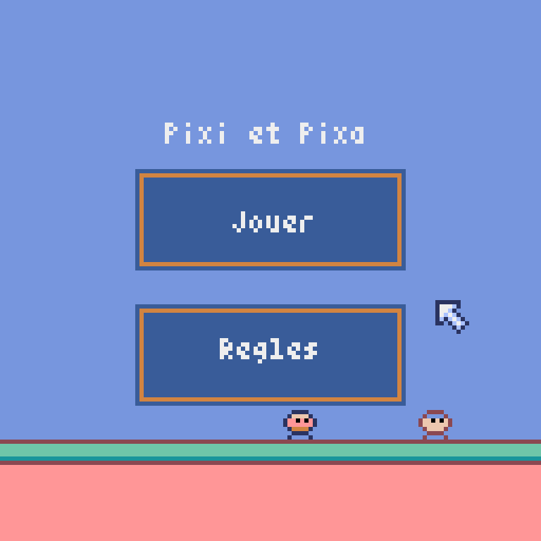
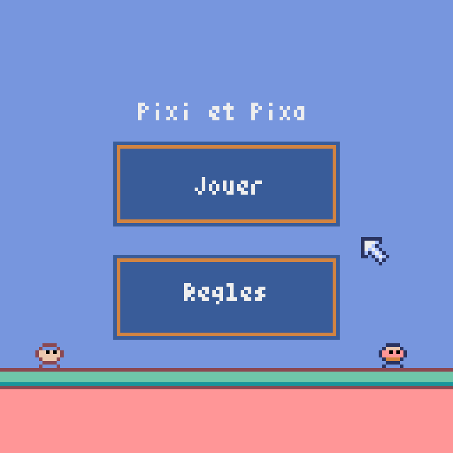

# Pixi et Pixa ( Nuit du Code )

> The librabry used

  

> First Level

  

> Second Level

  

## 🚀 What is my project ?
It's a cooperative game that I made with a friend in 6 hours, it was a contest organized around the world called [the night of the code](https://www.nuitducode.net/)

## 💻 Python library to install :

* [pyxel](https://github.com/kitao/pyxel) `pip install pyxel`

## :mailbox: Contact me : 💬
- 📧 Mail : [matthieu.gaudel04@gmail.com](mailto:matthieu.gaudel04@gmail.com)
- 📷 Instagram : [@matth_gdl](https://www.instagram.com/matth_gdl/)

## 🤝 Collaborater

<table align = "center">
  <tr>
    <td align="center">
      <a href="#">
         
        
          <b>Matthéo</b>
        
      </a>
    </td>
    <td align="center">
      <a href="#">
         
        
          <b>Matthieu</b>
        
      </a>
    </td>
  </tr>
</table>

